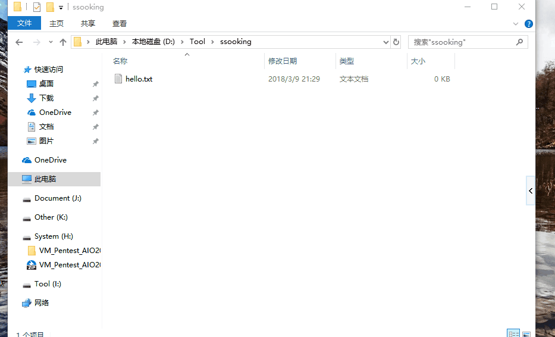
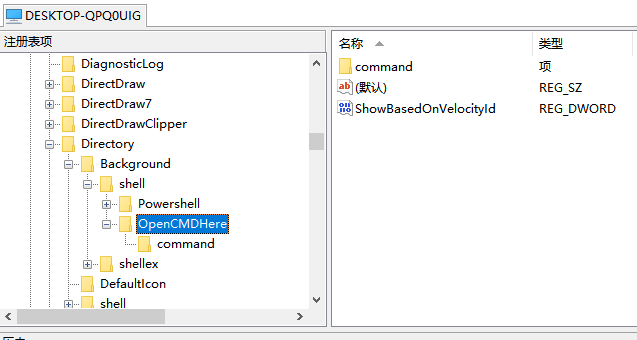
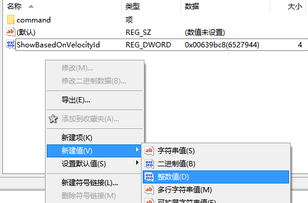
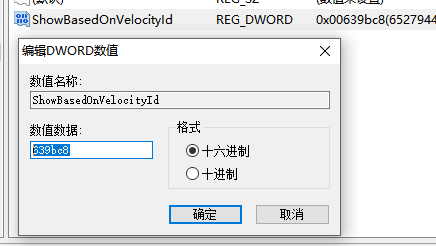
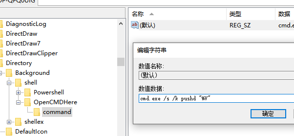
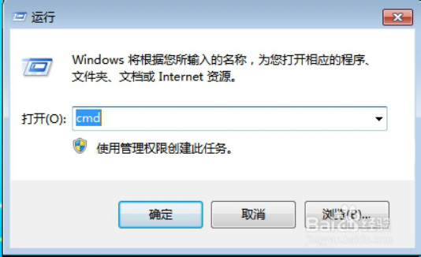
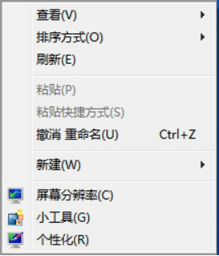
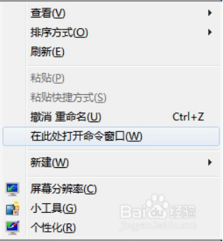
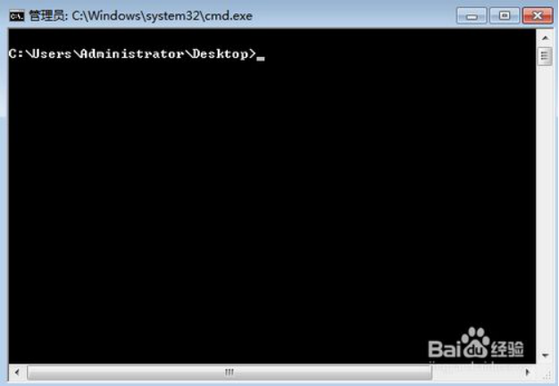

# Win10添加右键在此处打开命令行

通过添加注册表项,实现右击**“在此处打开命令行功能”

注册表位置：

```
HKEY_CLASSES_ROOT\Directory\Background\shell\
```

win10系统用标识右键菜单打开命令行的键，键值639bc8（十六进制）：

```
ShowBasedOnVelocityId（显示标识）
HideBasedOnVelocityId（隐藏标识）
```

**效果：**直接右键即可看到该选项，无需同时按住shift键。当然，按住右键也能显示，并且不影响右键打开powershell的功能。



 

**方法一：一键设置**

一键自动导入设置。将以下内容保存成reg文件，如a.reg，双击该文件自动导入设置。

```
Windows Registry Editor Version 5.00

[HKEY_CLASSES_ROOT\Directory\Background\shell\OpenCMDHere]
"ShowBasedOnVelocityId"=dword:00639bc8

[HKEY_CLASSES_ROOT\Directory\Background\shell\OpenCMDHere\command]
@="cmd.exe /s /k pushd \"%V\""
```


**方法二：手工设置**

1. 我们用regedit或者其他注册表编辑器定位到HKEY_CLASSES_ROOT\Directory\Background\shell\处，右击新建项“OpenCMDHere”，并在该项下，右击新建项“command”。

[](https://images2018.cnblogs.com/blog/1012328/201803/1012328-20180309212450145-1255797984.png)

2. 我们在右边OpenCMDHere项下，右击新建REG_DWORD类型整数值。设置键名为“ShowBasedOnVelocityId”，键值为“639bc8”。

[](https://images2018.cnblogs.com/blog/1012328/201803/1012328-20180309212528947-717627715.png)

[](https://images2018.cnblogs.com/blog/1012328/201803/1012328-20180309212631340-206016513.png)

3.进入command项下，设置键值为cmd.exe /s /k pushd "%V"

[](https://images2018.cnblogs.com/blog/1012328/201803/1012328-20180309212838393-713871806.png)

 

**方法三：快捷键直达功能**

Win7系统大家习惯“Win+R”的组合键打开命令提示符。



 通常情况下，我们点击鼠标右键是没有命令行选项的。



1. 在桌面上先按住Shift键，然后鼠标右键，出现选项“在此处打开命令窗口（W）”也可以打开命令行。



2. 点击“在此处打开命令窗口（W）”，进入CMD命令行界面。



# 参考文献

[Win10添加右键在此处打开命令行](https://www.cnblogs.com/ssooking/p/8536468.html)

[右键在目录当前打开命令行CMD窗口](https://www.cnblogs.com/weihu/p/9069554.html)